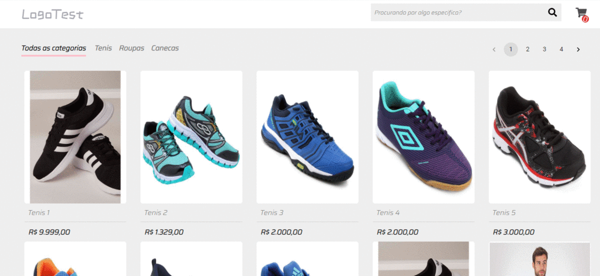

<h1 align="center">Shop</h1>

<h1 align="center">:page_with_curl: Descrição do Projeto</h1>

<p align="center">Um projeto de loja feito com React/Nodejs tem com o intuito de aprimorar as habilidades em ReactJs/Redux e Nodejs tem o uso de Aws S3 para hospedagem de fotos dos produtos.</p>

<p align="center">
  
</p>


<h1 align="center">:computer: Tecnologias</h1>

<ul>
    <li><a href="https://pt-br.reactjs.org/">ReactJs</a></li>
    <li><a href="https://styled-components.com/">StyleComponents</a></li>
    <li><a href="https://github.com/axios/axios">Axios</a></li>
    <li><a href="https://redux.js.org/">Redux</a></li>
  <li><a href="https://eslint.org/">Eslint</a></li>
  <li><a href="https://prettier.io/">Prettier</a></li>
  <li><a href="https://www.npmjs.com/package/history">History</a></li>
  <li><a href="https://www.npmjs.com/package/prop-types">Prop-types</a></li>
  <li><a href="https://redux-saga.js.org/">Redux Saga</a></li>
  <li><a href="https://www.docker.com/">Docker</a></li>
  <li><a href="https://nodejs.org/en/">Nodejs</a></li>
  
</ul>

<h1 align="center"> 
	:books: Instruções 
</h1>

	Após as configurações abaixo veja o arquivo .env examplo para substituir as variaveis

<p>Primeiro precisa ser criado dois container no docker um para o servidor Mysql e o um de Redis que sera usado para o servidor de Email com o nodeMailer </p>

```

# Instale uma imagem do MYSQL
docker run --name shop -e MYSQL_PASSWORD=root -p 3306:3306 -d mysql

# Inicie o Redis
docker start redis-gobarber

# Inicie o Mysql
docker start gobarber
```

<h1>Iniciando o Back End</h1>

```
# Após te baixado o repositorio 
yarn ou npm install

#Inicialize o Sequelize e rode a seguinte sequencia de comandos para rodar as migrations e seeders no seu banco 

yarn sequelize db:migrate
yarn sequelize db:seed:all

# Iniciando o BackEnd
yarn dev ou Npm run dev

# Iniciando a queue
yarn queue ou npm run queue

#Configurando Amazon S3

AWS_BUCKET=Substitua no env por suas configurações
AWS_ACCESS_KEY_ID=Substitua no env por suas configurações
AWS_SECRET_ACCESS_KEY=Substitua no env por suas configurações
AWS_DEFAULT_REGION=Substitua no env por suas configurações


```


<h1>Iniciando o Front-End</h1>

```
# Após te baixado o repositorio 
yarn ou npm install

#Simplesmente rode o comando abaixo

yarn start ou npm run start

```
